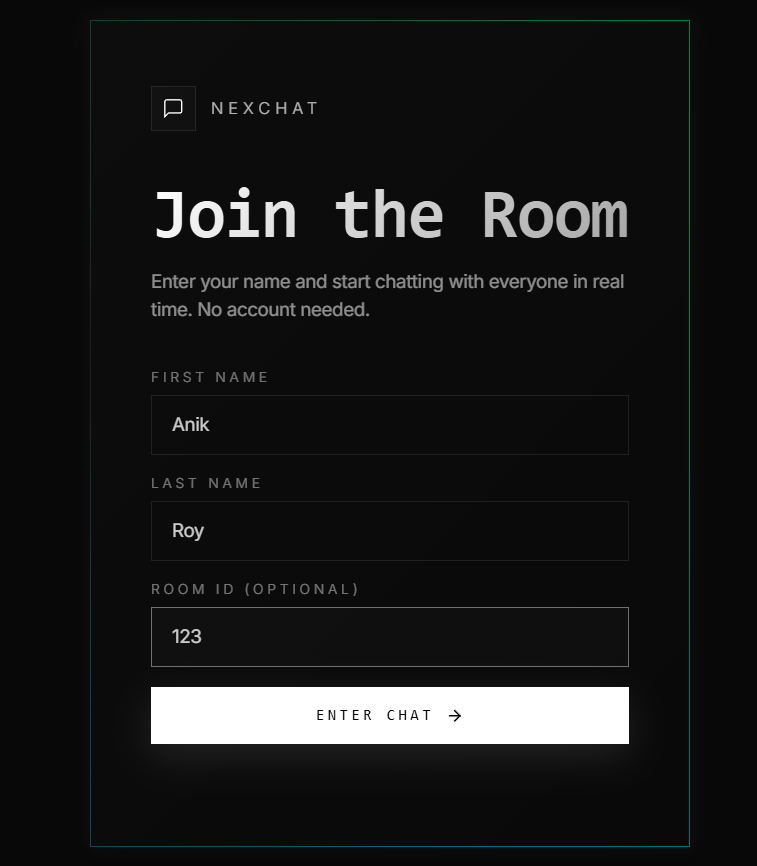

# 💬 NexChat — A Real-Time Chat System

> A sleek, no-account-needed real-time chat application built with **Node.js**, **Express**, and **Socket.IO**. Join a public room instantly or create a private room with a shareable Room ID — works seamlessly across desktop and mobile.

---

## ✨ Features

- **No account required** — Just enter your name and start chatting
- **Private & public rooms** — Create a private room or join one using a Room ID
- **Real-time messaging** — Powered by Socket.IO for instant bi-directional communication
- **Live online user list** — See who's currently in the room
- **Cross-device support** — Fully responsive on desktop, tablet (iPad), and mobile (Android/iOS)
- **Join/leave notifications** — Room activity is visible to all participants
- **Clean dark UI** — Minimal and distraction-free interface

---

## 🖼️ Screenshots

### 1. Join the Room — Dashboard
> Enter your first name, last name, and an optional Room ID to join a specific private room. No account or password needed.



---

### 2. Private 1v1 Chat (Desktop)
> Two users chatting in a private room. The sidebar shows online members with real-time presence indicators.


---

### 3. Multi-User Private Room (Desktop)
> Multiple users sharing the same Room ID — the room acts as a private group chat. The Room ID can also be shared publicly to let anyone join.


---

### 4. Chat on iPad
> The full desktop layout adapts perfectly to tablet screens, showing the sidebar alongside the chat window.


---

### 5. Chat on Android
> On mobile, the layout shifts to a streamlined single-column view for a comfortable experience.


---

## 🛠️ Tech Stack

| Layer | Technology |
|-------|-----------|
| Runtime | Node.js |
| Server Framework | Express v5 |
| Real-Time Engine | Socket.IO v4 |
| Frontend | HTML, CSS, Vanilla JS |

---

## 🚀 Getting Started

### Prerequisites

- [Node.js](https://nodejs.org/) (v14 or higher recommended)
- npm (comes bundled with Node.js)

Verify your installations:

```bash
node -v
npm -v
```

---

### Installation & Running Locally

**Step 1 — Clone the repository**

```bash
git clone https://github.com/EtheSonX082531/NexChat---A-Chat-System-.git
```

**Step 2 — Navigate into the project folder**

```bash
cd "NexChat---A-Chat-System-"
```

**Step 3 — Install dependencies**

```bash
npm install
```

**Step 4 — Start the server**

```bash
node index.js
```

**Step 5 — Open in your browser**

```
http://localhost:3000
```

> The app runs on port `3000` by default. Open the URL in any modern browser to start chatting!

---

## 🔒 How Room Privacy Works

| Scenario | Result |
|----------|--------|
| No Room ID entered | You join the default public room |
| Custom Room ID entered | Only people with the same ID join your room |
| Share your Room ID | Anyone with the code can join your private room |

---

## 📁 Project Structure

```
NexChat---A-Chat-System-/
├── public/             # Frontend files (HTML, CSS, JS)
├── Screen Shorts/      # App screenshots
├── index.js            # Main server entry point (Express + Socket.IO)
├── package.json        # Project metadata and dependencies
└── package-lock.json   # Locked dependency versions
```

---

## 🤝 Contributing

Contributions are welcome! Feel free to fork the repo, make your changes, and submit a pull request.

---

## 👤 Author

**Anik** — [GitHub Profile](https://github.com/EtheSonX082531)

---

## 📄 License

This project is licensed under the **ISC License**.
